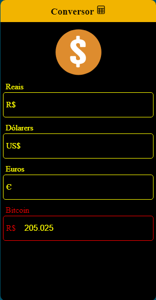

# conversor_de_moedas_versaoReactJS

<h2>Sobre o projeto</h2>
Conversor de moedas similar ao já desenvolvido em Flutter, porém agora em ReactJS. 
Basta digitar o valor no campo da moeda que deseja converter, e automaticamente, aparece a conversão pronta nas duas outras moedas.  

O campo do valor do bitcoin não é alterável, ele apenas mostra o valor, em reais, do bitcoin no momento atual. 

Por exemplo, digitando o valor de 1 do campo de reais, temos isso: 

Todos os valores vieram da API que pode ser acessada em https://docs.awesomeapi.com.br/api-de-moedas
